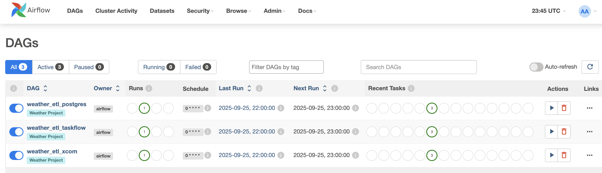
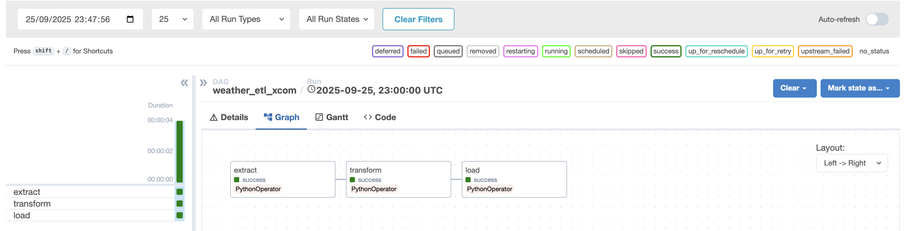
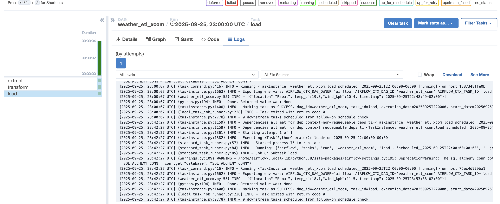
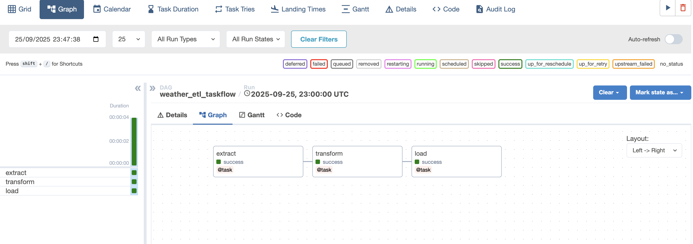
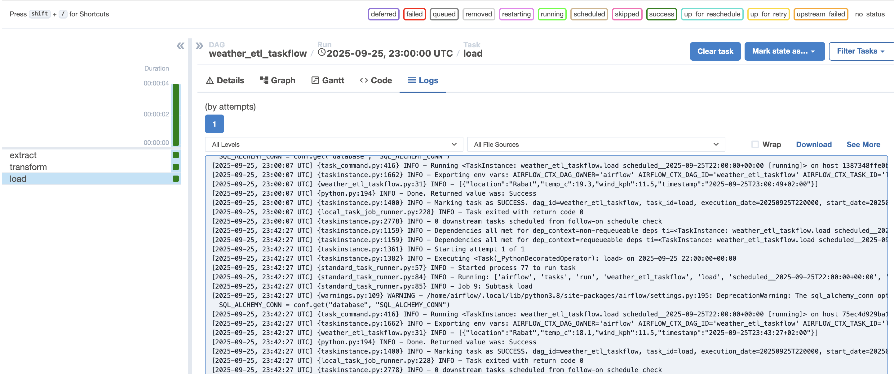
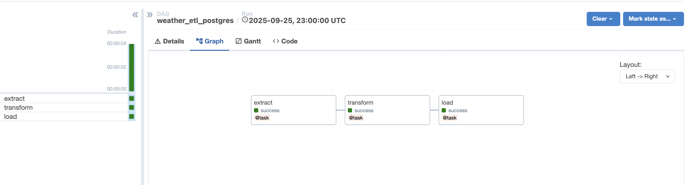
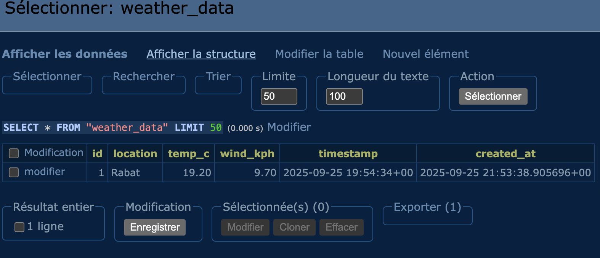

# ETL Weather avec Apache Airflow

Pipeline ETL utilisant Airflow avec trois méthodes :
- **XCom traditionnel** - Communication explicite entre tâches
- **TaskFlow API** - Approche moderne avec décorateurs  
- **PostgreSQL** - Stockage des données

## Prérequis

- **Docker** and **Docker Compose**
- **WeatherAPI key** (free at [weatherapi.com](https://www.weatherapi.com/))


## Architecture

## Architecture Airflow avec CeleryExecutor

| Composant      | Rôle                                           |
|----------------|-----------------------------------------------|
| **Scheduler**  | Planifie les tâches et les envoie à Redis.    |
| **Redis**      | File d’attente pour les tâches.               |
| **Celery Executor**   | Distribue les tâches aux Workers.             |
| **Worker**     | Exécute les tâches récupérées depuis Redis.   |
| **PostgreSQL** | Base de données des métadonnées Airflow + données weather|
| **Webserver**  | Interface web pour gérer et monitorer les DAGs |
| **Adminer**    | Interface web pour gérer la base PostgreSQL. |


## Fichiers

### Méthodes ETL :
- `weather_etl_xcom.py` - XCom traditionnel
- `weather_etl_taskflow.py` - TaskFlow API  
- `weather_etl_postgres.py` - Intégration PostgreSQL

### Support :
- `transformer.py` - Convertit les données météo en tableau JSON simple
- `table.sql` - Crée la table pour stocker les données
- `.env` - Définit les paramètres et dépendances du projet
- `docker-compose.yml` - Configuration des services

## Docker

### Démarrer les services :
```bash
docker-compose up -d
```

### Arrêter :
```bash
docker-compose down
```

### Supprimer (avec volumes) :
```bash
docker-compose down -v
```

### Status :
```bash
docker-compose ps
```

## Accès

| Service | URL | Login |
|---------|-----|-------|
| Airflow | [localhost:8080](http://localhost:8080) | admin/admin |
| Adminer | [localhost:8081](http://localhost:8081) | abdel/abdel |

### Adminer config :
- Server: `postgres`
- Database: `RabatWeather`


### Obtenir la clé API :
1. Créer un compte sur [WeatherAPI.com](https://www.weatherapi.com/)
2. Récupérer votre clé API gratuite
3. Remplacer dans les 3 fichiers DAG :
```
'Key': 'VOTRE_CLE_API'
```

## Résultats

### Vue d'ensemble

**Les 3 DAGs actifs dans le tag "Weather Project"**

### XCom Traditionnel

**Toutes les tâches exécutées avec succès**


**Résultats dans les logs de la tâche load**

### TaskFlow API

**Tâches TaskFlow réussies**


**Résultats dans les logs de la tâche load**

### PostgreSQL

**Insertion en base réussie**


**Données stockées dans la table weather_data**

---

**Toutes les méthodes fonctionnent et produisent les mêmes données météo.** ✅

